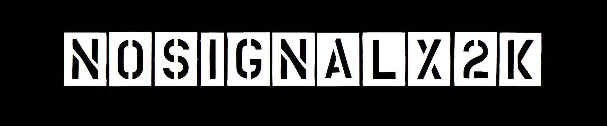

# Beginner ML Engineer and Data Scientist
- Student of the Southern Federal University
- Working on statistics and analytical problems
- Participated and won in regional competitions and hackathons on machine learning
- _*You can view my CV by clicking on the banner_

## My stack:

## Follow me

