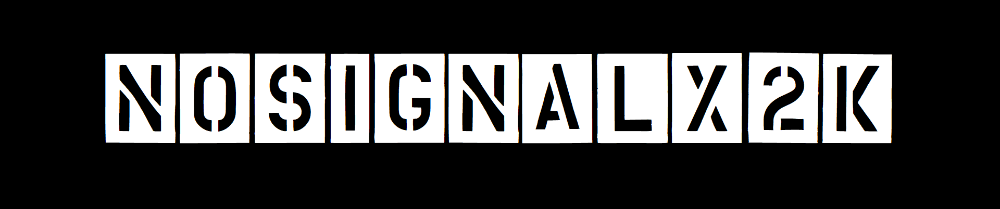

# 🧭 Codex of nosignalx2k

> _“Engineer of structured intelligence. Explorer of hidden connections.”_  
> _Architecting systems where logic meets meaning._

📘 [🇷🇺 Русская версия профиля](./README.ru.md)

---

## TL;DR

- 🎓 ML Developer & Researcher, 3 Scopus papers, 20+ AI publications
- 🔬 Focus: Graph Machine Learning, RL agents, AI for science & industry
- 🧩 Notable Projects: Face Swap, BIOHACK, Abeona, CVAT-integrated tools
- ⚙️ Tech Stack: Python, PyTorch, OpenCV, Docker, K8s, FPGA, LLM fine-tuning
- 🌍 Based in Rostov-on-Don / Taganrog | 🇷🇺 RU | 🇬🇧 EN (B1)

---

## 🧙 About the Author

I see code not as a tool — but as **a glyph**, a **living structure**.  
My work lies at the intersection of AI, mathematics, and human sense-making.  
Each repository is a node in a larger graph of ideas.

> “To build is to align the chaos of input with the elegance of emergence.”

---

## 🔬 Research Activity

- 🧠 3 publications in Scopus-indexed journals
- 📚 20+ publications in Russian AI & automation journals (RISC, VAK)
- 🧭 Regular speaker at AI/ML conferences

---

## 🔧 Tech Arsenal

- **Programming**: Python, NumPy, Pandas, Polars, OpenCV
- **ML Frameworks**: PyTorch, TensorFlow, Keras
- **Deployment**: Docker, Kubernetes, CI/CD
- **Specialized**: LLM alignment, RL, Graph ML, FPGA/ASIC

---

## 📦 Projects & Artifacts

| 🧩 Name | Description | Link |
|--------|-------------|------|
| Face Swap w/ Diffusion | Realistic face replacement using inpainting | [Repo](https://github.com/vadim-voloshchuk/Face-Swap-with-Diffusion-Models) |
| BIOHACK | Reverse face images from vector embeddings | [Repo](https://github.com/vadim-voloshchuk/BIOHACK) |
| Abeona LifeHub | Voice-based productivity assistant with AI | [Repo](https://github.com/vadim-voloshchuk/ABEONA_NEXT) |
| CVAT Autoseg | Custom U-Net model for CVAT auto-segmentation | _Private_ |
| CyberGarden | Graph classifier of IT-solutions (case study) | [Repo](https://github.com/vadim-voloshchuk/CyberGarden) |

> _"Each of these is a piece of a greater architecture, designed to solve, augment, or reveal."_

---

## 📬 Contact

---

> 📄 [Click here to download my resume (PDF)](./rezume_81935699.pdf)

---

## 🔗 External Links

- 🌐 [CodeWars Profile](https://www.codewars.com/users/vadim-voloshchuk)
- 🧠 [Publications](./Competitions.md)
- 📈 [Project Showcase (coming soon)]()
